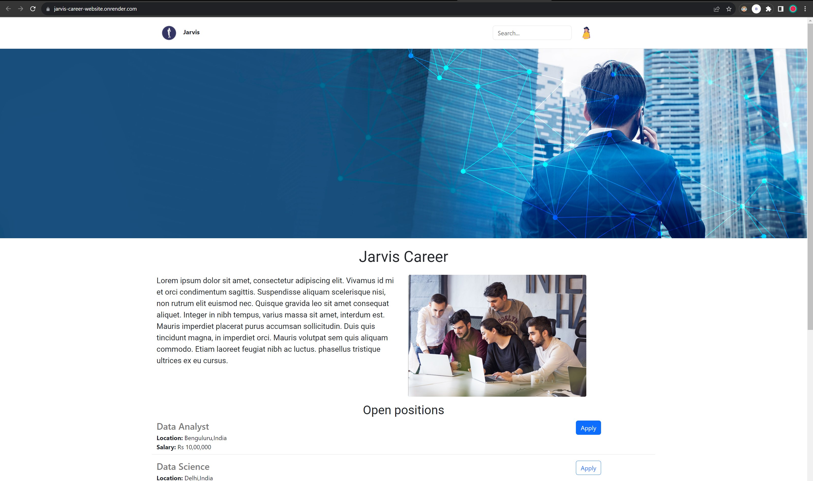

##
<h1 align="center">Jarvis Career</h1>

Jarvis Career is a web application that helps users explore job opportunities, connect with potential employers, and streamline the job application process. The project is divided into several steps, covering everything from project setup to deploying a production-ready database-driven web application.

## Table of Contents
    <ul>
        <li>Technologies Used</li>
        <li>Requirements</li>
        <li>Installation</li>
        <li>Usage</li>
        <li>Contribution Guidelines</li>
    </ul>

## Technologies Used 🛠️
    <ul>
        <li>Python</li>
        <li>Flask</li>
        <li>MySQL</li>
        <li>Bootstrap</li>
        <li>Render.com</li>
    </ul>

## Preview ⚡️

  

## Website 💻
<a href="https://jarvis-career-website.onrender.com/" type="button">Jarvis-Career-Website</a>
 
## Requirements
    <ul>
        <li>Python 3.x</li>
        <li>Flask</li>
        <li>Gunicorn</li>
        <li>Render.com account (for deployment)</li>
    </ul>

## Installation 🖥️
    <ol>
        <li>Clone the GitHub repository:</li>
        <code>git clone &lt;repository-url&gt;</code>
        <li>Install the required Python packages:</li>
        <code>pip install -r requirements.txt</code>
    </ol>

## Usage 📋
    <ol>
        <li>Run the Flask development server:</li>
        <code>python app.py</code>
        <li>Access the application in your web browser at <a href="http://localhost:5000">http://localhost:5000</a>.</li>
    </ol>

## Contribution Guidelines💡
    <ol>
        <li>Fork the repository.</li>
        <li>Create a new branch.</li>
        <li>Make your changes and commit them.</li>
        <li>Push to the forked repository.</li>
        <li>Create a pull request.</li>
    </ol>

Don't forget to leave a 🌟.

</body>
</html>
